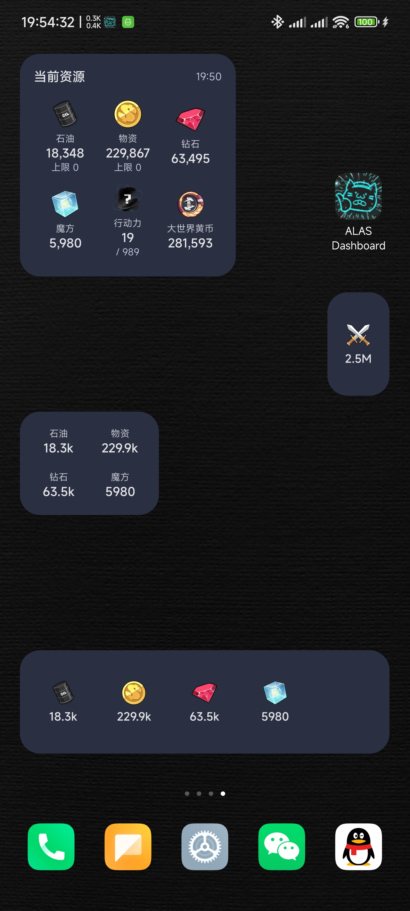
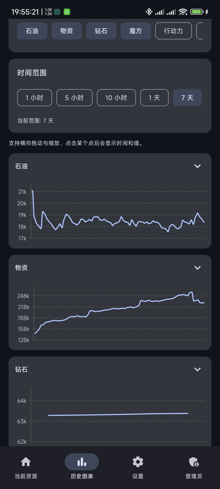

# ALAS Dashboard Android

一个用于查看 `AzurLaneAutoScript` Dashboard API 数据的安卓客户端，支持当前资源、历史图表、管理员管理、小组件与通知提醒。

## 服务端来源

本 App 对接的服务端基于以下项目：

- 原仓库: [LmeSzinc/AzurLaneAutoScript](https://github.com/LmeSzinc/AzurLaneAutoScript)
- 当前使用分支仓库: [603185423/AzurLaneAutoScript](https://github.com/603185423/AzurLaneAutoScript), (dashboard照着[Zuosizhu/Alas-with-Dashboard](https://github.com/Zuosizhu/Alas-with-Dashboard)抄的)

服务端通过独立的 Dashboard API 对外提供资源与管理接口。

## 启动服务端

在 `AzurLaneAutoScript` 对应仓库根目录下执行：

```powershell
.\toolkit\python.exe -m module.dashboard_api --config ./config/dashboard_api.yaml
```

启动后，默认接口形式类似：

```text
http://127.0.0.1:22367/api/v1/...
```

## App 功能

- `当前资源` 页面：查看最新资源值与刷新结果
- `历史图表` 页面：查看不同资源的历史趋势
- `设置` 页面：配置 API 地址、用户令牌、轮询、主题、通知规则
- `管理员` 页面：使用管理员令牌管理用户与轮换 token
- `桌面小组件`：支持多种尺寸，并可自定义显示哪些资源

## 如何配置 App

首次使用时，服务器通常只有 `Admin Token`，还没有可直接用于手机端的普通用户令牌。

建议按下面步骤配置：

1. 在 `Base URL` 中填写 Dashboard API 地址，例如 `http://192.168.1.10:22367`
2. 先在 `Admin Token` 中填写管理员令牌
3. 进入 `管理员` 页面，创建一个普通用户
4. 记录创建成功后返回的一次性 `User Token`
5. 回到 `设置` 页面，把该 `User Token` 填入 `User Token`
6. 保存后返回 `当前资源` 页面刷新，确认可以正常拉取数据
7. 如需后台刷新，可在设置中调整轮询间隔并开启后台同步
8. 如需桌面小组件，可添加小组件后选择要显示的资源

## 截图





## 说明

- App 需要服务端先启动并可从手机访问
- `Base URL` 不要带 `/api/v1` 后缀，只填写服务根地址即可
- 首次使用时需要先填写 `Admin Token`，创建普通用户后才能得到 `User Token`
- `User Token` 用于资源查询与推送对应的用户空间
- `Admin Token` 用于创建用户、管理用户和轮换用户 token
